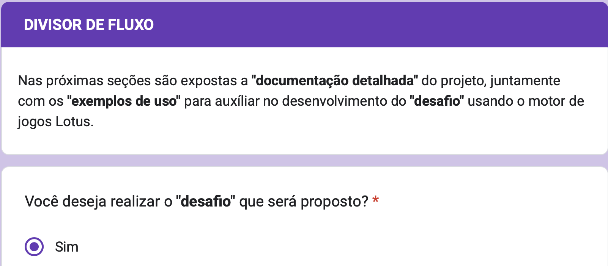

# Unidade 4: Conceitos Básicos 3D - atividade  

## Desafio (opcional)

Como desafio, proponho um trabalho opcional que, se realizado, acrescentará um ponto à sua média.  
A atividade consiste em responder a um questionário de avaliação de um TCC, que irá guiá-lo por etapas que envolvem implementação de código.  
Atenção: o ponto extra só será concedido se todas as instruções do questionário forem seguidas, e avançar no questionário para a parte do *desafio*:  
  

<https://docs.google.com/forms/d/e/1FAIpQLSfp7hZ6R7X6F13iZ59K1GvXUPwQq6xV5yRFYZ4sZp_rEqTX3w/viewform>  

## Atividade Individual

\[peso: 2,0] Esta atividade é para ser desenvolvida individualmente pelo aluno, no caso, não é em equipe. Essa atividade serve para reforçar/praticar os conceitos relacionados a Unidade 4.  

[Atividade4_VisEdu](Atividade4_VisEdu.md)  

## Atividade em Equipe

\[peso: 8,0]  

Lembretes:

- todas as questões deste trabalho devem ser desenvolvidas para serem executadas em um **único** projeto.  
- obrigatoriamente devem usar as classes disponibilizadas na Unidade2 e Unidade3, junto com as que foram criadas nesta unidade em [CG_N4_Exemplo](./CG_N4_Exemplo/).  
Mas **ATENÇÃO**, o [CG_N4_Exemplo](./CG_N4_Exemplo/) tem alguns ajustes para ser feito, como por exemplo, algumas faces do cubo não estão na orientação certa e devem ser ajustadas.  
- usem a pasta **Unidade4** do GitHub da sua equipe para desenvolver/entregar o seu código.  

## O que deve ser feito

Agora os principais objetivos do trabalho final (da Unidade 4) é usar os conceitos apresentados em aula sobre Câmera Sintética e considerando o uso correto do ```GL.Enable``` para usar funções de:

- Textura: ver exemplos [5-Textures](https://github.com/opentk/LearnOpenTK/tree/master/Chapter1/5-Textures) e [6-MultipleTextures](https://github.com/opentk/LearnOpenTK/tree/master/Chapter1/6-MultipleTextures);  
- Iluminação: [Chapter2](https://github.com/opentk/LearnOpenTK/tree/master/Chapter2).  

usando como fonte de pesquisa [LearnOpenTK](https://github.com/opentk/LearnOpenTK).  

Então desenvolva uma cena com dois cubos. Um cubo maior (fixo na origem do SRU) no centro da tela que tenha como textura em todas as suas faces uma foto dos integrantes da equipe. O cubo menor deve "orbitar" envolta do cubo maior girando em torno do eixo Z no sentido anti-horário. Com o uso do mouse se poderá visualizar envolta do cubo maior sempre olhando para o centro dele. E, por fim, poder mudar a iluminação usando as telas:

- tecla \[1]: 2-BasicLighting  
- tecla \[2]: 4-LightingMaps  
- tecla \[3]: 5-LightCasters-DirectionalLights  
- tecla \[4]: 5-LightCasters-PointLights  
- tecla \[5]: 5-LightCasters-Spotlight  
- tecla \[6]: 6-MultipleLights  
- tecla \[0]: sem iluminação

## Gabarito

  

----------

## ⏭ [Início)](../README.md "Início")  
