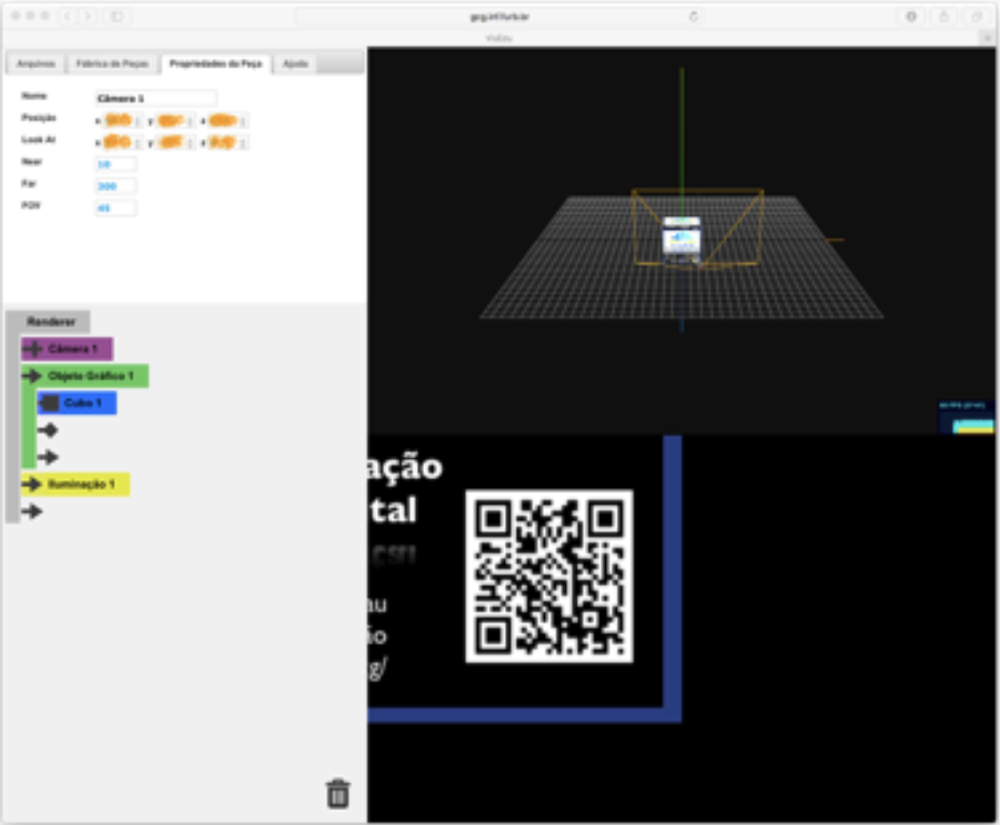
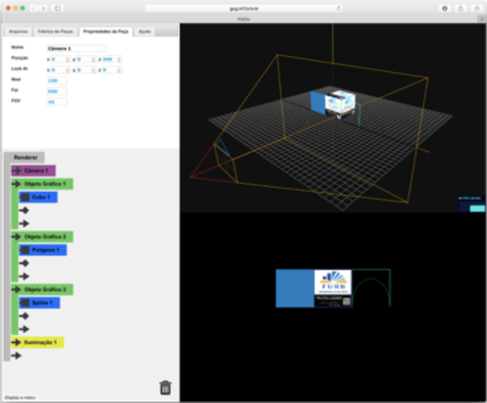
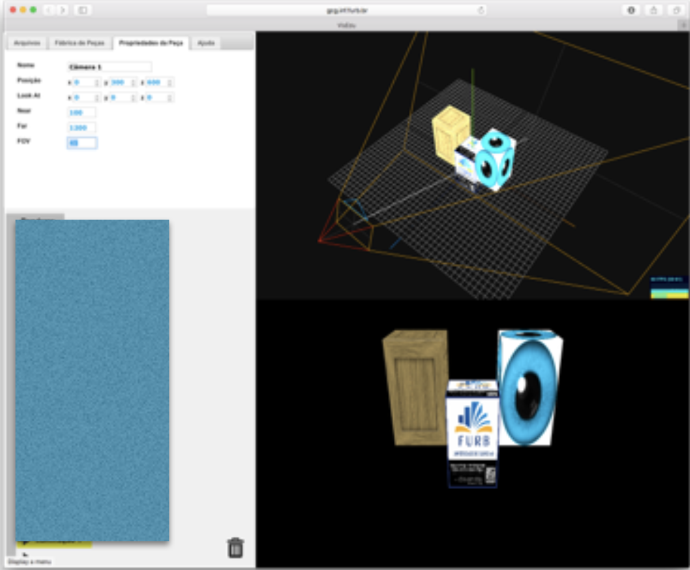
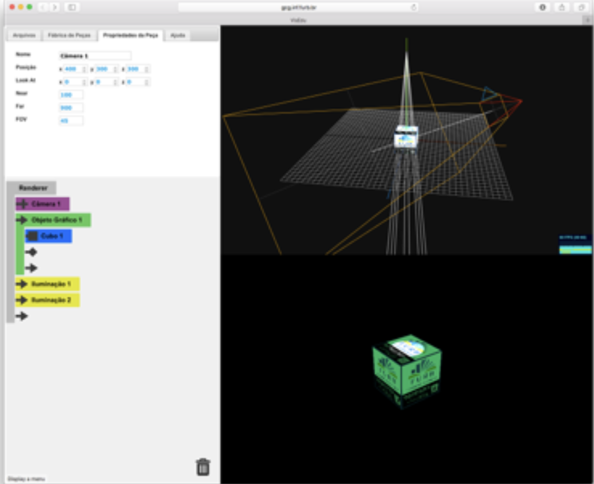

# Unidade 04 - Conceitos básicos de 3D - Trabalho Individual  

**Informações utilizadas no exercício:**  

- Aonde encontrar o VisEdu-CG: [https://gcgfurb.github.io/yoda/](https://gcgfurb.github.io/yoda/ "VisEdu-CG")  
- Os arquivos das respostas devem ser postados dentro da pasta da "Unidade4/SeuNome"  
- Cada arquivo de resposta deve ser nomeado com o número do exercício em questão (1.json, 2.json, 3.json e 4.json)  

---

## 1) (peso 0,5)  

Crie uma cena utilizando o VisEdu-CG que somente contenha as peças:  

- "Camera"  
- "Objeto Gráfico"  
- "Cubo" (com textura "Logo Grupo CG")  
- "Iluminação"  

Após, altere as **Propriedades** da peça "Camera 1" no "Renderer" para mudar o ponto de vista do observador na cena. A visualização do objeto "Cubo 1" deve ser a mais próxima possível ao exibido na imagem abaixo. Neste caso utilize os valores de "Near = 10", "Far = 300" e "FOV = 45" também descrito na figura abaixo, mudando os valores de "Posicao" e "Look At". Os valores de "Tamanho" e "Posição" do "Cubo 1" não devem ser alterados.

---

## 2) (peso 0,5)  

Crie uma cena utilizando o VisEdu-CG que **somente** contenha as peças descritas na figura abaixo para que tem as mesmas texturas
e representação visual. No caso o tamanho do objeto "cubo" foi mantido com 100 unidades e esta posicionado com a face de baixo (a do cubo) com valor no plano "zero" do eixo Z. Os Objetos "Polígono" e "Spline" tem a sua BBox com o mesmo tamanho do "cubo" e estão alinhado com o eixo Z em zero. O "cubo" tem a face da frente também alinhada com o eixo Z em zero.

---

## 3) (peso 0,5)  

Crie uma cena utilizando o VisEdu-CG para ter o resultado visual conforme figura abaixo. Não é permitido mudar os parâmetros dos
objetos "Cubo", somente o valor da sua textura. O objeto "Cubo 1" tem o seu centro com coordenadas (0,0,0) coincidindo com a origem, os outros dois "Cubos" sofreram transformação geométrica e se encontram adjacentes ao "Cubo 1". Todos os objetos "Cubo" são ampliados somente na altura em duas vezes ao seu tamanho original usando uma transformação geométrica. Neste caso esta cena somente pode conter as peças: uma "Câmera", uma "Iluminação", três "Objetos Gráficos", três "Cubo", uma "Escalar" e dois "Transladar".

---

## 4) (peso 0,5)  

Use o arquivo ["CG-04_exer_04.json"](./CG-04_exer_04.json) (entrada) e com somente as peças descritas na figura abaixo para reproduzir o efeito visual gerado pela iluminação.

---

**Boa prática!**
