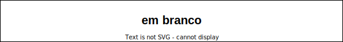

# Computação Gráfica - Unidade 4  

<!-- TODO: arrumar
Interface, Transformações 2D e Seleção, Programação orientada a eventos. Elementos de interface, Eventos e atributos de elementos de interface. Funções callback (teclado e mouse). Transformações de sistemas de coordenadas Transformações geométricas 2D, Algoritmos de seleção, Boundaring Box.  

Objetivo: demonstrar conhecimento no desenvolvimento de sistemas com interface gráfica com o usuário. Interpretar, especificar e desenvolver aplicações simples com transformações geométricas.  -->

## [Atividades - Aula](Atividade4.md "Atividades - Aula")  

## Rabiscos

## Material  

[cg-slides_u4.pdf](./cg-slides_u4.pdf "cg-slides_u4.pdf")  

### 2023-11-14

  
  

----------

## ⏭ [Unidade 1)](../Unidade1/README.md "Unidade 1")  
